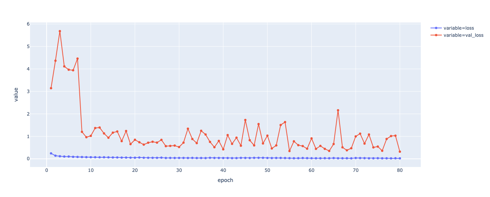

# crop_seedings

------------------------------------------------
#### Convolutional Neural Network classifier for image recognition of 12 different crop seeding species, at different stages of growth. 

###### Plants types (with 4750 total image inputs)

 - Black-grass
 - Charlock
 - Cleavers
 - Common Chickweed
 - Common wheat
 - Fat Hen
 - Loose Silky-bent
 - Maize
 - Scentless Mayweed
 - Shepherds Purse
 - Small-flowered Cranesbill
 - Sugar beet

##### Outcome

- Presented image classifier algorithm (CNN) with the overal test accuracy of 90%.
- Including 'class_weight' for unbalanced dataset helps to decrease the model complexity and save computational time.

Model validation accuracy and loss:

 
 
 

